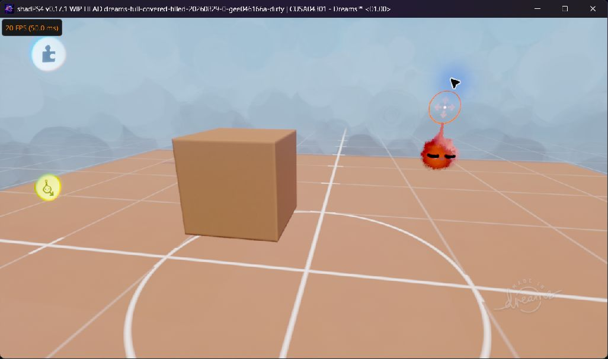

# Dreams on shadPS4

Updated **October 6, 2026**. This repository contains experimental shadPS4 fixes and tested builds for Dreams (`CUSA04301`).

## Latest tested build

**[October 6 tweak-menu blur build and activation instructions](TWEAK_MENU_BLUR_FIX_20261006.md)** — user confirmed the tested menu looks correct at all distances. Includes the tested EXE, opt-in launch script and source patches.

Previous October 4 checkpoint:

**[Download shadps4.exe — October 4 selector reset and paint rendering fix](https://github.com/JesusDaBest/Dreams-ShadPS4/raw/refs/heads/main/builds/cusa04301-selector-reset-fix-20261004/shadps4.exe)**

Use the executable with your existing launcher/runtime dependencies and **Precise GPU readbacks**. Diagnostic environment flags should be unset. This download is the exact diagnostic executable tested locally, rather than a complete portable runtime package.

## Confirmed improvements

- **Tweak-menu blur:** selected-mip coordinate correction passed close, normal and far tests for the tested menu. [Fix and activation instructions](TWEAK_MENU_BLUR_FIX_20261006.md).

- **Selector reset and paint rendering:** the severe pause/unpause lag stopped in the tested scene, selector IDs are now valid, and the user confirmed paint strokes render. [Fix and validation](SELECTOR_RESET_FIX_20261004.md).

- **Cube shading:** the cube now looks like an actual cube. Fixing zero-offset alignment instructions removed the tiled seams from the live cube and floor normals. [Fix and before/after evidence](SCULPT_ALIGNMENT_FIX_20261004.md).
- **Imp trails and tweak-menu smush:** persistent imp copies in menus and the tweak-menu smush were removed on the tested system. This fix is included in the new executable. [Validation record](IMP_SMUSH_FIX_20261004.md).
- **Scene save IDs:** three test scenes kept distinct version IDs, contents, and previews; discarding a fourth preserved all three. [Validation record](SAVE_ID_FIX_20261003.md).

## Current in-game screenshot

Captured directly from Dreams running the October 4 alignment-fix executable. The cube now renders with clean faces. This image shows the game itself; the separate GPU-normal comparison is in the [validation record](SCULPT_ALIGNMENT_FIX_20261004.md).

## New selector reset / paint-mode screenshot

Actual Dreams after the new fix, with paint tools open. Paint strokes now render according to the user; sculpt surface defects remain visible. The previous cube screenshot above is retained.

## Remaining work

- Check spheres and more complex sculpts with the alignment fix.
- Investigate sculpt-limit warnings, remaining low frame rates and other editing slowdowns. The demonstrated pause/unpause workload explosion is corrected locally.
- Verify the new tweak-menu blur correction across other menus, GPUs and versions; other missing content may remain.
- Verify other GPUs and game versions. A separate user's imp trails remain unresolved.

The successful local test used an **AMD Radeon 8060S**, **CUSA04301 VERSION 02.64** (APP_VER 01.00), and Precise readbacks. Version 02.65 and complete game compatibility are not verified. The cube improvement does not establish that all sculpt rendering or gameplay is fixed.

## Source and records

- [Selector reset fix and validation](SELECTOR_RESET_FIX_20261004.md)
- [Focused selector reset patch](patches/dreams-selector-reset-fix-20261004.patch)
- [Latest cumulative main-source snapshot](patches/dreams-diagnostic-source-20261004-selector-reset.patch)

- [Source build instructions](SOURCE_BUILD.md)
- [Focused alignment patch](patches/generic-align-zero-offset-fix-20261004.patch)
- [Cumulative main-source diagnostic patch](patches/dreams-diagnostic-source-20261004-sculpt-alignment.patch)
- [Current status](STATUS.md) and [remaining issues](ISSUES.md)
- [August/September investigation archive](HISTORICAL_README_20260907.md)
- [Historical August 29 build](builds/cusa04301-full-covered-filled-20260829) and [earlier October 4 imp/smush build](builds/cusa04301-imp-smush-cache-fix-20261004)

This repository contains no game files, firmware, keys, PSN credentials, or user saves. The emulator builds are experimental.
