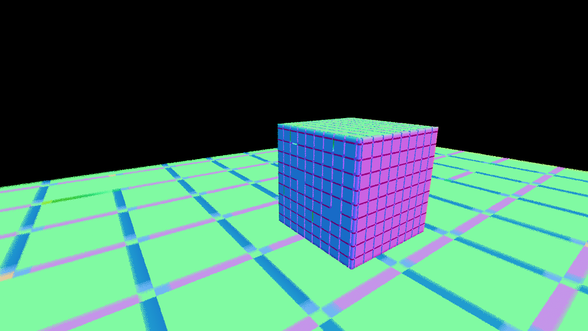
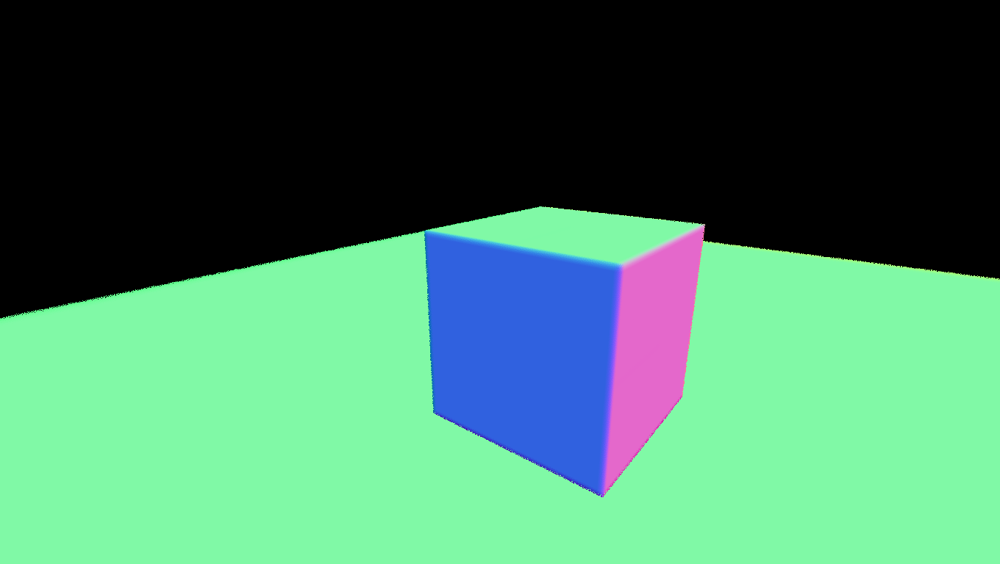

# Confirmed sculpt normal-seam correction — October 4, 2026

The test cube previously had a regular tiled surface and dark seams. Correcting zero-offset alignment instructions removed the tiled pattern from the live GPU normal output. The user confirmed: “Yes tons better it looks like an actual cube now”. This is a source correction in shadPS4, not a filter, replacement cube, or overlay.

## Cause and correction

The material shader `0xdcc325c2` reads packed neighboring sculpt blocks to calculate surface normals. The translator implemented `V_ALIGNBIT_B32` and `V_ALIGNBYTE_B32` by combining two 32-bit shifts. At offset zero, the high-word term shifted by 32. That is outside the defined range for a 32-bit SPIR-V shift; on the tested GPU it behaved like a shift by zero and mixed the next word into the result. See the [SPIR-V shift specification](https://registry.khronos.org/SPIR-V/specs/unified1/SPIRV.html).

The focused [source patch](patches/generic-align-zero-offset-fix-20261004.patch) explicitly contributes zero from the high word at offset zero and keeps every emitted high-word shift in the range 0–31. Both bit and byte alignment instructions are corrected without a game-specific gate.

## Validation

- The standalone CPU material evaluator reproduced the tiled normal pattern when the packed-read shift count wrapped. Returning zero for the high-word contribution at offset zero produced clean cube normals.
- 32,160 bit-alignment cases, including byte-alignment offsets 0/8/16/24, matched an independent concatenated 64-bit reference with zero mismatches.
- Source compilation and linking succeeded with the local single-job Release build.
- A live material-output capture in Dreams showed the tiled cube and floor normal seams removed. Adjacent cube pixels crossing sculpt-block boundaries had normal jumps above 10 degrees in 87.0% of pairs before and 1.6% after. Mean angular change dropped from 60.3 degrees to 0.52 degrees. These were different camera frames, not an exact pixel-parity comparison; real cube edges remain included in the counts.
- The user confirmed the visible cube improvement in Dreams.

Before:

After:

## Executable and source

Current in-game view, captured directly from the running tested executable:

Download [shadps4.exe](builds/cusa04301-sculpt-alignment-fix-20261004/shadps4.exe). This is the exact experimental diagnostic executable used for the successful live test. It also contains the retained imp/tweak-menu cache, random-byte and save-handling changes. Optional capture/replay diagnostics remain in the build; run with diagnostic environment flags unset. Use the existing launcher/runtime dependencies and Precise readbacks. The older executable remains available for comparison.

Executable SHA-256: `8C2E36874EEA2A4B83625D099E92F874F287EFE3894981CD93B6BC710454F904`.

The [cumulative tracked main-source patch](patches/dreams-diagnostic-source-20261004-sculpt-alignment.patch) records this build's tracked main-source changes against upstream `555c458c9fdd33cb4686492374519c7bb112a891`. It includes earlier research and diagnostic changes, so apply it to that base instead of stacking it with the historical cumulative patch. External/submodule changes and untracked scratch files are excluded; the retained [Sirit delta](patches/sirit-group-nonuniform-shuffle-20260829.patch) remains separately documented in [SOURCE_BUILD.md](SOURCE_BUILD.md). A fresh build from this exported cumulative snapshot has not been run. Local source HEAD before working changes was `ee046166afab8ca04759d5d34b63025a48fae2ae`.

The focused patch is the recommended change for code review or adding just the alignment correction to an existing source build. See [SOURCE_BUILD.md](SOURCE_BUILD.md) for the retained patch workflow.

## Limits

Verified on the local AMD Radeon 8060S system and the installed CUSA04301 02.64 content. This does not establish correct rendering of every sculpt, resolve the sculpt-limit/performance issue, verify distance-dependent tweak-menu content, or validate 02.65/other GPUs. The earlier friend's imp-trail issue remains a separate unverified report.
