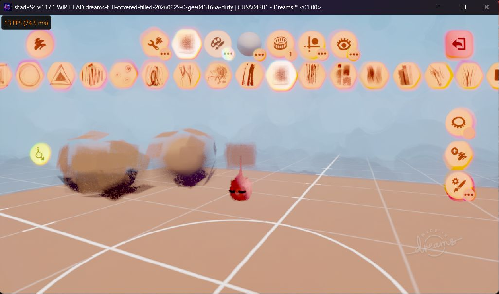

# Status — October 4, 2026

The earlier alignment [tested executable](builds/cusa04301-sculpt-alignment-fix-20261004/shadps4.exe) contains the user-confirmed sculpt alignment correction and the earlier imp/tweak-menu cache correction.

- The user confirmed that the cube now looks like an actual cube.
- Live GPU captures show the cube/floor tiled normal seams removed.
- Imp copies in menus and tweak-menu smush were corrected on the local system.
- The scene save-ID correction passed the documented isolated persistence test.

Verified system: AMD Radeon 8060S; CUSA04301 VERSION 02.64, APP_VER 01.00; Precise readbacks. Executable SHA-256: `8C2E36874EEA2A4B83625D099E92F874F287EFE3894981CD93B6BC710454F904`.

Other sculpt shapes, severe sculpt-editing lag, distance-dependent tweak-menu content, other GPUs, and 02.65 remain unverified or unresolved. See [the alignment validation](SCULPT_ALIGNMENT_FIX_20261004.md) and [current open issues](ISSUES.md).

## New selector reset and paint rendering update

The [latest executable](builds/cusa04301-selector-reset-fix-20261004/shadps4.exe) also preserves the real counter reset and selector compaction dispatches. The user confirmed paint strokes now render and the severe pause/unpause lag stopped. Before the correction, the affected pass jumped from 3,585 to 525,193 instances and took about 1.6–1.8 seconds. After correction, captured lists had 56 and 41 valid, distinct IDs with zero invalid IDs. See [validation and limitations](SELECTOR_RESET_FIX_20261004.md).

SHA-256: `DA5B2166B8245803E6D8F2BE4FC082B0CAB33E5D5366CE904118028BAB98C79C`. Other sculpt defects and low frame rates remain unresolved.

The earlier cube screenshot is retained in the [front-page status section](README.md#current-in-game-screenshot).

## Historical status records

Everything below preserves August/September observations. Its build identities, defects, and “latest” claims apply to those historical checkpoints, not the October 4 build.

> **Historical September 4 implementation draft:** [ORDERED_COUNT_DRAFT_20260904.md](ORDERED_COUNT_DRAFT_20260904.md) records the decoder, IR and runtime-metadata groundwork plus the next targeted experiment. That official-core draft did not implement GPU execution of DS_ORDERED_COUNT. Later standalone prototype results are recorded in [DOC_GDS_STORES_20260907.md](DOC_GDS_STORES_20260907.md); no newer working-game result is claimed.

> **Latest September 4 runtime test:** [CLEAN_CORE_TEST_20260904.md](CLEAN_CORE_TEST_20260904.md) records two actual official-core runs with the general GPU corrections. Both fail translating `DS_ORDERED_COUNT` in `cbac06d2`; Dreams is not working on this build. This supersedes the earlier plan to establish a clean-core run. Earlier GPU provenance and correction tests remain in [HANDOFF_20260904.md](HANDOFF_20260904.md).

## Game and build

- Title: `Dreams`
- Serial: `CUSA04301`
- Status date: September 2, 2026
- Playability: **not playable; major visual defects remain**
- Source base: `555c458c9fdd33cb4686492374519c7bb112a891`
- Validated executable SHA-256:
  `183D9914A395D8AD804428B418E13474D71172A6146386DD9E7D159F26AE14CC`
- Checkpoint directory:
  `builds/cusa04301-full-covered-filled-20260829`

## What is confirmed working in the checkpoint

- Offline startup reaches local menus, DreamShaping, saved scenes, and edit mode.
- UI, imp, edit grid, floor, and normal homespace lighting rendered in the validated run.
- A single cube sculpt rendered with a full outer volume: all visible sides were covered and filled.
- Sculpt and tweak-menu jitter was absent in that validated run. A later clean-cache run of the
  exact executable produced a dark cube with jitter, so cross-run visual reproducibility remains
  unresolved.
- The recorded edit-mode view ran at 30 FPS with broad diagnostics disabled.
- The exact `0x4ebeffd2` ordered-count collect/prefix/replay path ran without fallback, Vulkan
  validation, device-loss, or out-of-memory errors.

## What remains wrong

- The sculpt surface is a regular grid of rounded panels instead of the intended Dreams flecks.
- Correct paint strokes, complex sculpts, characters, tutorials, and premade Dreams are not yet
  regression-confirmed on this checkpoint.
- Other scenes and camera distances can still expose culling, LOD, material, or performance issues.
- In a controlled eleven-primitive scene, sphere and both donuts never reached producer
  `0x2bfebd3c`; several surviving primitives rendered as cube-like proxies.
- In a later held-state capture, `0x2bfebd3c` published indirect X = 0, traversal dispatched
  `(0,1,1)`, and an indexed scene draw reached `instanceCount=0` while UI still rendered.
- The user experienced severe edit-mode lag in the September 2 x4 ordered-counter build. No
  oversized dispatch was logged, and cache misses/stale pipelines confound the run, so causality
  remains unresolved.
- The experimental source contains extensive diagnostics and title-specific paths and is not yet an
  upstream-ready general shadPS4 change.
- Online community content, historical Dreams servers, and PSN entitlement behavior are not
  implemented or verified.

## Confirmed rendering conclusion

The B1 seed-writer shader `0x4ebeffd2` required guest-logical `DS_ORDERED_COUNT` allocation rather
than host atomic arrival order. Exact GPU collect/prefix/replay fixed the missing-volume and jitter
symptoms in the known scene.

The current highest-priority loss is upstream of visible rendering. Producer `0x2bfebd3c` received
only eight of eleven expected primitive records in one capture, and published zero indirect X in a
later fully empty held state. The next discriminator is the producer bound at flattened SRT word
41 (`SRT root + 0x64`): refresh it once to distinguish stale host/SRT state from a genuinely empty
input, then trace the first incorrect predicate, ordered prefix, or publication edge. The panel
pattern and dark material state remain separate downstream questions.

See [HANDOFF_20260902.md](HANDOFF_20260902.md) for the complete evidence and continuation order.

## Rejected current hypothesis

The A3 (`0xa3a9e9ef`) dynamic ReadConst range was explicitly prewarmed for one falsification run.
The range was already registered before the prewarm. The experiment was reverted and must not be
described as part of the visible improvement.

## Verification record

- Exact executable size: `70,621,696` bytes.
- Release compilation succeeded with one parallel job.
- Patch pair reapplied cleanly to fresh worktrees.
- `git diff --check` passed for the checkpoint source.
- 69 tests ran: 68 passed and one optional real-capture test skipped.
- Validation screenshot SHA-256:
  `327C9E07B595A4E113C69ADF555F8928A804D676B0BFE912B651D822DF09ECB8`.
- Published exact-tree source branch: `dreams-dev-20260829-full-covered-filled` at
  `b84847d1b6ca14d349bf9e11e91d14ae182e008d`.

## Safety

Use an isolated portable `user` directory and preserve a save backup. The checkpoint includes no
game content, firmware, keys, credentials, or user saves.
