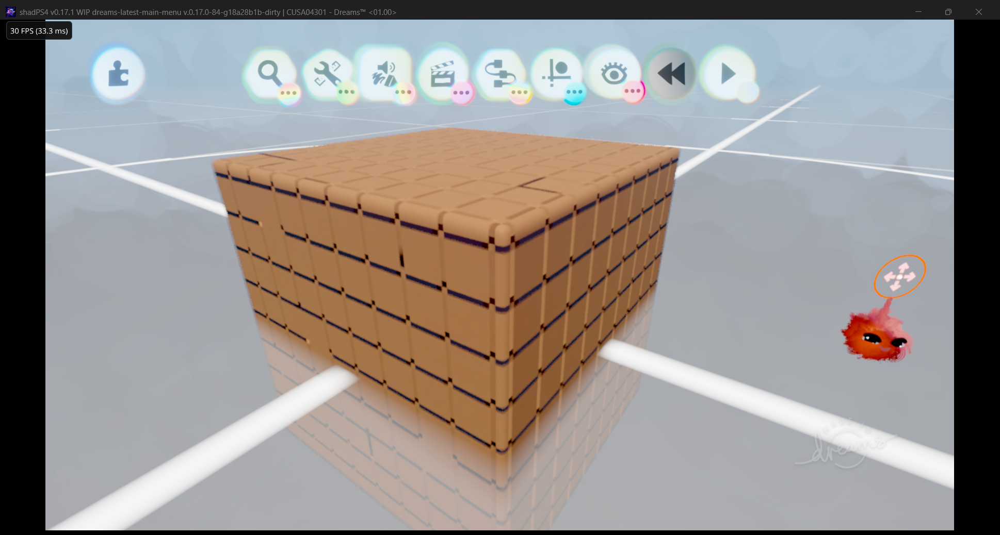

# Dreams CUSA04301 full-covered/full-filled checkpoint

This directory preserves the exact executable validated on 2026-08-29.

- The test cube rendered fully covered and fully filled.
- Sculpt and tweak-menu jitter was no longer present.
- Performance was 30 FPS in the validated edit-mode view.
- The remaining defect is the incorrect tiled/panel-like sculpt surface; this is a checkpoint, not the final Dreams fix.
- The key new correctness path is exact `ds_ordered_count` collect/prefix/replay for compute shader `0x4ebeffd2`.

## Binary

- File: `shadps4.exe`
- Size: `70,621,696` bytes
- SHA-256: `183D9914A395D8AD804428B418E13474D71172A6146386DD9E7D159F26AE14CC`
- Game: Dreams `CUSA04301`

Launch with the Dreams `eboot.bin` as the sole argument and use the normal runtime user directory. No diagnostic `SHADPS4_*` environment flags are required.

The matching source state is preserved by
[`patches/dreams-focused-20260829-full-covered-filled.patch`](../../patches/dreams-focused-20260829-full-covered-filled.patch),
based on upstream shadPS4 commit `555c458c9fdd33cb4686492374519c7bb112a891`. Apply the
separate Sirit patch documented in [DEVELOPMENT.md](../../DEVELOPMENT.md) before building. Do not
replace this executable with later experiments unless they are separately validated.

See [INVESTIGATION.md](INVESTIGATION.md) for the evidence, rejected hypotheses, remaining defect, and next diagnostic target.
